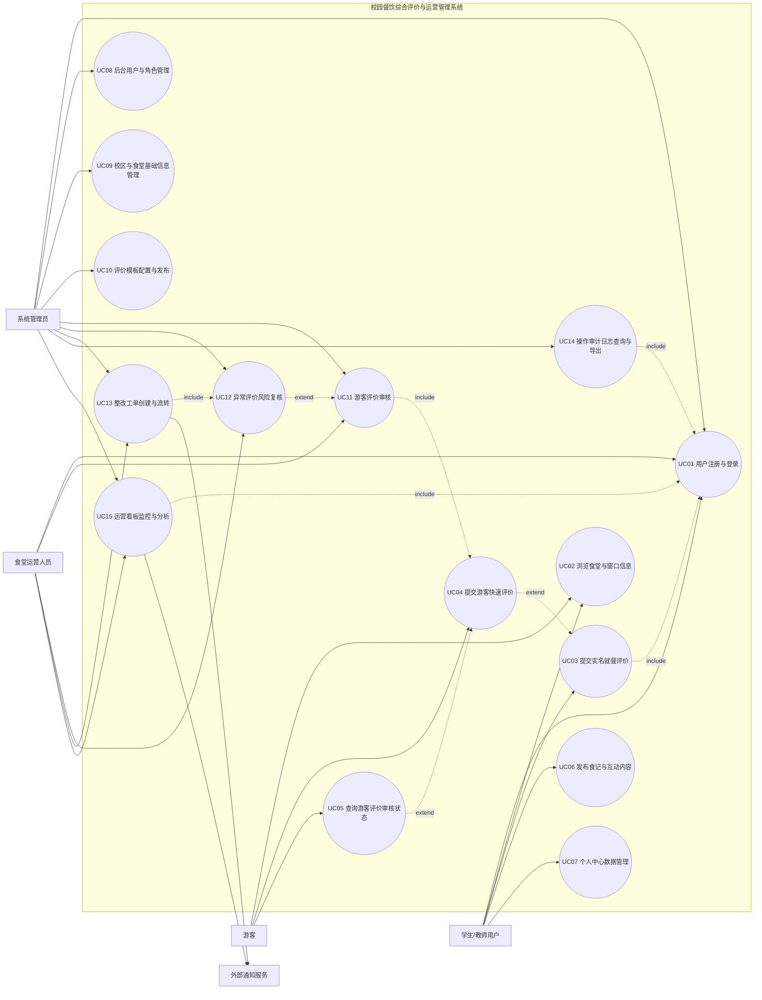

# 第三章 系统需求分析

## 3.0 章节引导与系统边界
本章在前文业务背景与系统设计目标的基础上，围绕“校园餐饮体验平台”开展系统需求分析，重点回答系统“应提供什么服务、应达到什么质量水平、应遵循哪些约束条件”三个核心问题。需求分析结果将作为后续系统设计、实现与测试验收的直接依据。

### 3.0.1 系统边界定义
本系统边界定义为“校园餐饮综合评价与运营管理系统”，覆盖以下业务域：
1. 面向学生/教师用户的餐饮评价、食记发布、个人中心管理。
2. 面向游客用户的快速评价与状态查询。
3. 面向食堂运营人员的异常复核、整改工单、运营看板。
4. 面向系统管理员的用户管理、校区管理、模板管理、审计日志与系统配置。

### 3.0.2 参与者定义
1. 学生/教师用户：实名登录后提交评价、发布内容、查看个人数据。
2. 游客：未登录或临时身份用户，提交游客评价并查询审核状态。
3. 食堂运营人员：处理食堂运营问题，负责复核与整改闭环。
4. 系统管理员：执行全局配置、审核、审计和权限管理。
5. 外部通知服务：为系统提供站内消息、短信或邮件通知能力。

---

## 3.1 功能性需求分析

### 3.1.1 功能域分解
系统功能按照业务职责划分为五个功能域：
1. 身份与访问控制：注册、登录、会话校验、角色判定。
2. 评价与内容管理：实名评价、游客评价、食记发布、个人内容管理。
3. 治理与闭环管理：游客审核、风险复核、整改工单流转。
4. 平台配置与审计：用户管理、校区管理、评价模板管理、操作审计。
5. 运营分析与通知：运营看板、A/B实验监控、异常通知。

### 3.1.2 系统用例图（Mermaid）

### 3.1.3 核心用例清单
1. UC01 用户注册与登录。
2. UC02 浏览食堂与窗口信息。
3. UC03 提交实名就餐评价。
4. UC04 提交游客快速评价。
5. UC05 查询游客评价审核状态。
6. UC06 发布食记与互动内容。
7. UC07 个人中心数据管理。
8. UC08 后台用户与角色管理。
9. UC09 校区与食堂基础信息管理。
10. UC10 评价模板配置与发布。
11. UC11 游客评价审核。
12. UC12 异常评价风险复核。
13. UC13 整改工单创建与流转。
14. UC14 操作审计日志查询与导出。
15. UC15 运营看板监控与分析。

---

### 3.1.4 用例规约（15个）

## UC01 用户注册与登录
- 目标：用户能够完成账号注册、登录并获得合法会话。
- 参与者：学生/教师用户、食堂运营人员、系统管理员。
- 包含：会话校验子用例。
- 扩展：登录失败重试、账号锁定。
- 泛化：无。
- 前置条件：用户具备可用账号；系统认证服务可用。
- 触发条件：用户访问登录页并提交凭证。
- 后置条件：
1. 成功：会话建立，用户身份写入会话上下文，进入对应门户。
2. 失败：会话不建立，失败日志被记录。
- 主场景：
1）用户输入账号密码并提交。
2）系统校验账号、密码与角色。
3）系统返回登录成功并建立会话。
4）系统按角色跳转到前台或后台主页。
- 其他场景：
1）用户首次注册：系统校验用户名规则后创建账号，再进入登录流程。
- 异常场景：
1）连续多次密码错误触发账号临时锁定，系统提示稍后重试。
- 发生频率：高（工作日全天持续发生）。
- 限制：用户名与密码需符合长度与格式要求。
- 注释：该用例是多数后台用例的前置包含用例。

## UC02 浏览食堂与窗口信息
- 目标：用户快速获取食堂、窗口、菜品及基础公示信息。
- 参与者：学生/教师用户、游客。
- 包含：食堂列表查询、窗口详情查询。
- 扩展：按校区过滤。
- 泛化：无。
- 前置条件：食堂与窗口基础数据已初始化。
- 触发条件：用户进入首页、食堂详情页或窗口详情页。
- 后置条件：
1. 成功：系统返回对应校区范围内的食堂与窗口数据。
2. 失败：系统提示暂无数据或加载失败。
- 主场景：
1）用户进入食堂列表页面。
2）系统返回可访问的食堂列表。
3）用户点击某食堂查看窗口与菜品摘要。
4）系统展示窗口信息、营业时段与基础评价指标。
- 其他场景：
1）用户切换校区，系统刷新为目标校区数据。
- 异常场景：
1）目标食堂不存在或已下线，系统返回提示并回退到列表页。
- 发生频率：高。
- 限制：游客仅可访问公开信息，不可访问个人化数据。
- 注释：该用例为评价与推荐用例提供上下文数据。

## UC03 提交实名就餐评价
- 目标：实名用户提交一次完整、可追溯的就餐评价。
- 参与者：学生/教师用户。
- 包含：UC01 用户注册与登录、模板项加载。
- 扩展：重复提交拦截。
- 泛化：无。
- 前置条件：用户已登录且已选择食堂/窗口。
- 触发条件：用户点击“提交评价”。
- 后置条件：
1. 成功：评价主记录与明细记录入库，统计指标增量更新。
2. 失败：评价不入库，系统返回错误原因。
- 主场景：
1）用户填写环境、服务、食安、菜品等评分项。
2）系统校验参数完整性与合法范围。
3）系统写入评价主表与明细表。
4）系统返回提交成功并刷新前端状态。
- 其他场景：
1）用户先保存草稿后再补充提交，最终按主场景完成入库。
- 异常场景：
1）短时间内重复提交触发防重机制，系统返回“请稍后再试”。
- 发生频率：高（餐后时段集中）。
- 限制：单次提交评分必须落在模板定义区间。
- 注释：该用例是风险识别与工单治理的数据源头。

## UC04 提交游客快速评价
- 目标：游客无需注册即可提交轻量化评价反馈。
- 参与者：游客。
- 包含：窗口选择、简化评分录入。
- 扩展：UC03（实名评价的简化扩展）。
- 泛化：无。
- 前置条件：游客可访问评价页面，目标窗口可用。
- 触发条件：游客扫码进入快速评价页面并提交。
- 后置条件：
1. 成功：提交记录进入“待审核”状态。
2. 失败：记录不落库并给出错误提示。
- 主场景：
1）游客选择食堂和窗口。
2）游客填写简化评分与备注。
3）系统校验并写入游客提交表，状态设为 pending。
4）系统返回提交成功与记录ID。
- 其他场景：
1）游客补充图片或附加说明，系统一并保存。
- 异常场景：
1）字段缺失或格式错误，系统拒绝提交并提示修正。
- 发生频率：中。
- 限制：游客数据默认不直接进入正式评价统计。
- 注释：该用例与UC11构成“提交-审核-入库”链路。

## UC05 查询游客评价审核状态
- 目标：游客可根据提交记录ID查看审核进展。
- 参与者：游客。
- 包含：状态查询。
- 扩展：UC04。
- 泛化：无。
- 前置条件：游客已获得提交记录ID。
- 触发条件：游客输入记录ID并发起查询。
- 后置条件：
1. 成功：返回 pending/approved/rejected 状态及时间信息。
2. 失败：提示记录不存在或无权限查看。
- 主场景：
1）游客输入记录ID。
2）系统校验请求来源与记录关联性。
3）系统返回审核状态与备注。
- 其他场景：
1）状态已通过，系统提示“已计入正式评价”。
- 异常场景：
1）来源IP不匹配，系统拒绝访问并返回403。
- 发生频率：中低。
- 限制：仅允许查询与自身提交上下文匹配的记录。
- 注释：有助于提升游客反馈透明度。

## UC06 发布食记与互动内容
- 目标：用户发布图文食记，形成校园餐饮互动内容。
- 参与者：学生/教师用户。
- 包含：内容提交、敏感词检测。
- 扩展：匿名发布。
- 泛化：无。
- 前置条件：用户已登录。
- 触发条件：用户在发布页提交内容。
- 后置条件：
1. 成功：内容进入审核队列或直接发布（按策略）。
2. 失败：内容不发布并提示原因。
- 主场景：
1）用户填写标题与正文，上传图片。
2）系统执行格式校验与敏感词检测。
3）系统保存笔记并设定状态。
4）系统返回发布结果。
- 其他场景：
1）用户选择匿名发布，系统隐藏对外展示昵称。
- 异常场景：
1）内容命中禁用词规则，系统阻断发布并提示修改。
- 发生频率：中。
- 限制：标题与正文长度、图片大小受系统限制。
- 注释：与内容审核和敏感词策略联动。

## UC07 个人中心数据管理
- 目标：用户管理个人资料、查看历史评价与收藏。
- 参与者：学生/教师用户。
- 包含：个人资料查询、我的评价查询、我的收藏查询。
- 扩展：分页与状态筛选。
- 泛化：无。
- 前置条件：用户登录成功。
- 触发条件：用户进入个人中心页面。
- 后置条件：
1. 成功：返回个人数据并允许修改非敏感字段。
2. 失败：返回未登录或参数错误。
- 主场景：
1）用户进入个人中心。
2）系统加载用户信息、评价记录、收藏清单。
3）用户修改昵称或手机号并提交。
4）系统保存并返回最新信息。
- 其他场景：
1）用户按“待处理/已处理”筛选历史治理状态。
- 异常场景：
1）会话失效，系统重定向到登录页。
- 发生频率：中高。
- 限制：敏感字段变更需通过严格校验。
- 注释：可承接整改进展可视化展示。

## UC08 后台用户与角色管理
- 目标：管理员维护平台账号、角色和状态。
- 参与者：系统管理员。
- 包含：用户列表查询、新增用户、编辑用户、状态切换。
- 扩展：运营账号绑定食堂。
- 泛化：无。
- 前置条件：管理员已登录且具有用户管理权限。
- 触发条件：管理员进入用户管理页并执行操作。
- 后置条件：
1. 成功：用户数据更新，权限立即生效。
2. 失败：更新回滚并返回失败原因。
- 主场景：
1）管理员查询用户列表。
2）管理员新增或编辑目标用户。
3）系统校验角色与绑定关系合法性。
4）系统保存并记录审计日志。
- 其他场景：
1）创建运营账号时必须绑定指定食堂。
- 异常场景：
1）运营账号未绑定食堂，系统拒绝保存。
- 发生频率：中低。
- 限制：仅管理员可执行该用例。
- 注释：该用例影响后台多模块授权范围。

## UC09 校区与食堂基础信息管理
- 目标：管理员维护校区基础信息与启停状态。
- 参与者：系统管理员。
- 包含：校区增删改查、状态管理、排序管理。
- 扩展：按状态筛选。
- 泛化：无。
- 前置条件：管理员具备配置权限。
- 触发条件：管理员进入校区管理页。
- 后置条件：
1. 成功：校区信息更新并用于后续租户隔离。
2. 失败：更新被拒绝并保留原状态。
- 主场景：
1）管理员新建或编辑校区。
2）系统校验校区名称与编码唯一性。
3）系统保存并刷新列表。
- 其他场景：
1）管理员停用校区，系统阻止该校区新业务写入。
- 异常场景：
1）删除存在关联数据的校区时系统拒绝删除并提示处理依赖。
- 发生频率：低。
- 限制：默认校区不可删除。
- 注释：该用例是多校区治理基础能力。

## UC10 评价模板配置与发布
- 目标：管理员按业务需求动态调整评价维度模板。
- 参与者：系统管理员。
- 包含：模板创建、细项编辑、草稿保存、版本发布。
- 扩展：模板版本回看。
- 泛化：无。
- 前置条件：管理员已登录。
- 触发条件：管理员进入模板管理页并操作。
- 后置条件：
1. 成功：新版本模板生效并被评价端读取。
2. 失败：保持原版本生效状态。
- 主场景：
1）管理员创建模板草稿。
2）管理员编辑评分细项与分值范围。
3）系统保存草稿并校验完整性。
4）管理员发布模板，系统切换为 active。
- 其他场景：
1）管理员仅修改模板名称不发布，系统保持草稿态。
- 异常场景：
1）模板缺失必要类别时，系统拒绝发布并提示补全。
- 发生频率：低。
- 限制：发布动作需具备管理员权限。
- 注释：模板变更需考虑历史评价兼容性。

## UC11 游客评价审核
- 目标：管理员/运营人员对游客评价执行通过或驳回。
- 参与者：系统管理员、食堂运营人员。
- 包含：游客评价列表查询、单条审核、批量审核。
- 扩展：UC04。
- 泛化：无。
- 前置条件：存在待审核游客评价。
- 触发条件：审核人员进入审核页面并提交决策。
- 后置条件：
1. 通过：游客评价写入正式评价主数据。
2. 驳回：保留提交记录并写入驳回原因。
- 主场景：
1）审核人员筛选待审记录。
2）审核人员查看详情并选择通过。
3）系统将数据入正式评价表并更新状态。
4）系统记录审核人和审核时间。
- 其他场景：
1）审核人员批量通过或批量驳回多条记录。
- 异常场景：
1）记录状态已变化（并发审核），系统跳过并提示已处理。
- 发生频率：中。
- 限制：运营人员仅可审核其授权食堂范围记录。
- 注释：该用例是游客数据进入正式统计的唯一通道。

## UC12 异常评价风险复核
- 目标：对异常评价进行风险级别复核并确定处理动作。
- 参与者：系统管理员、食堂运营人员。
- 包含：风险扫描、风险列表查询、复核决策。
- 扩展：由UC11审核后数据触发。
- 泛化：无。
- 前置条件：系统存在可评估的评价数据。
- 触发条件：复核人员执行“重新扫描”或进入风险列表。
- 后置条件：
1. 成功：风险记录状态更新为 approved/watch/rejected。
2. 失败：保留原状态并记录失败日志。
- 主场景：
1）系统扫描并生成风险标记。
2）复核人员查看风险分、规则命中项。
3）复核人员选择通过、观察或驳回并备注。
4）系统记录复核结论。
- 其他场景：
1）复核人员对高风险记录直接触发建单。
- 异常场景：
1）风险记录不存在或已处理，系统提示并终止本次操作。
- 发生频率：中。
- 限制：仅授权角色可进行复核决策。
- 注释：该用例与UC13形成治理闭环入口。

## UC13 整改工单创建与流转
- 目标：对问题评价形成工单并完成全流程闭环管理。
- 参与者：食堂运营人员、系统管理员、外部通知服务。
- 包含：工单创建、状态流转、SLA扫描、日志记录。
- 扩展：包含UC12复核结果。
- 泛化：无。
- 前置条件：问题来源（风险记录或手工录入）有效。
- 触发条件：用户点击“建单”或“新建工单”。
- 后置条件：
1. 成功：工单在 pending/processing/review/completed/archived 中流转并留痕。
2. 失败：工单不变更并返回错误原因。
- 主场景：
1）运营人员创建工单并填写标题、问题描述、关联对象。
2）系统保存工单并初始化状态。
3）责任人执行接单、送审、完成、归档。
4）系统在关键节点触发通知并更新统计。
- 其他场景：
1）系统定时执行SLA扫描并标记逾期。
- 异常场景：
1）非法状态跳转请求被拒绝并记录异常日志。
- 发生频率：中。
- 限制：状态流转需符合预定义状态机。
- 注释：该用例直接支撑管理端“整改闭环率”指标。

## UC14 操作审计日志查询与导出
- 目标：管理员可追溯关键操作并导出审计数据。
- 参与者：系统管理员。
- 包含：日志查询、过滤、导出CSV。
- 扩展：UC01。
- 泛化：无。
- 前置条件：系统已记录审计日志。
- 触发条件：管理员进入审计页面并发起查询/导出。
- 后置条件：
1. 成功：返回日志列表或导出文件。
2. 失败：返回错误提示且不导出。
- 主场景：
1）管理员按动作、操作者、时间范围筛选日志。
2）系统返回分页结果。
3）管理员执行导出。
4）系统生成并返回CSV文件。
- 其他场景：
1）管理员仅查看单条详情，不执行导出。
- 异常场景：
1）导出参数非法或超限，系统拒绝导出并提示缩小范围。
- 发生频率：中低。
- 限制：仅系统管理员可访问。
- 注释：用于合规审查、责任追踪与问题复盘。

## UC15 运营看板监控与分析
- 目标：运营人员和管理员监控核心指标并支持决策。
- 参与者：食堂运营人员、系统管理员、外部通知服务。
- 包含：指标聚合、图表渲染、报表导出。
- 扩展：推荐A/B实验指标监控。
- 泛化：无。
- 前置条件：系统具备可统计数据。
- 触发条件：用户进入运营看板页面或点击刷新。
- 后置条件：
1. 成功：展示最新指标并支持导出。
2. 失败：展示失败提示并保留上次成功数据。
- 主场景：
1）用户选择校区/食堂过滤条件。
2）系统聚合今日、周、月及趋势指标。
3）系统展示图表、预警与AB实验指标。
4）用户按需导出报表。
- 其他场景：
1）运营人员仅查看其绑定食堂数据。
- 异常场景：
1）接口超时或后端聚合失败，系统提示重试并记录异常。
- 发生频率：高（后台日常核心页面）。
- 限制：角色不同导致可见范围不同。
- 注释：该用例支撑管理决策与绩效评价。

---

## 3.2 非功能性需求分析（质量需求）

### 3.2.1 性能需求
系统需保证在校园常规高峰场景下可稳定响应。

1. 并发处理能力需求：
1）系统应支持评价提交、审核处理、看板查询等并发请求的稳定处理；
2）后台异步任务处理线程应受控，避免资源抢占造成主流程阻塞。

2. 响应速度需求：
1）核心页面（首页、评价页、看板页）首屏加载应在可接受范围内；
2）评价提交和审核决策接口应在短时内返回明确结果；
3）看板刷新与导出操作应在业务可接受时延内完成。

3. 数据处理效率需求：
1）批量审核、批量导出、统计聚合任务应具备可预期完成时限；
2）SLA扫描与风险扫描应支持周期性执行，不显著影响线上请求。

验证标准：
1. 采用接口压测与页面性能采样，验证高峰时段平均响应时间、P95响应时间。
2. 采用批量任务压测验证审核与导出的处理时长。
3. 采用稳定性测试验证长时间运行下无明显性能劣化。

### 3.2.2 安全需求
系统需在身份、数据、权限、审计四个层面保障安全。

1. 身份认证与权限控制：
1）系统应基于角色执行访问控制，禁止越权操作；
2）登录失败达到阈值后应进行临时锁定；
3）会话应采用安全Cookie策略并设置合理有效期。

2. 数据安全：
1）系统应使用安全传输协议保护数据传输；
2）敏感信息应采用最小暴露原则；
3）核心业务数据应防止非法篡改。

3. 业务安全：
1）评价提交应具备防重复提交机制；
2）游客状态查询应具备上下文校验，避免任意越权查询。

4. 可追溯安全：
1）后台关键操作应写入审计日志；
2）日志查询与导出应受权限控制。

验证标准：
1. 权限测试：以不同角色执行越权请求，预期全部被拦截。
2. 安全测试：对登录、会话、重复提交进行异常场景测试。
3. 审计测试：关键操作后日志可查询、可导出且字段完整。

### 3.2.3 可靠性需求
系统应在异常场景下保持数据一致与业务连续。

1. 数据一致性需求：
1）评价主表与明细表写入应保持事务一致性；
2）游客审核通过后，提交记录与正式评价记录应保持状态一致。

2. 故障恢复需求：
1）系统应支持数据库备份与恢复；
2）发生接口异常时应保留可追踪日志，便于快速恢复。

3. 异常处理需求：
1）风险复核、工单流转应对非法输入有清晰处理策略；
2）工单状态迁移应严格遵循状态机，防止脏状态。

验证标准：
1. 通过事务回滚测试验证数据一致性。
2. 通过故障注入验证错误恢复与日志完整性。
3. 通过状态迁移测试验证非法流转被拒绝。

### 3.2.4 可用性需求
系统应面向多角色提供清晰、连续、可理解的交互体验。

1. 操作可理解性需求：
1）页面入口应清晰，操作路径应符合角色认知；
2）关键动作（提交、审核、流转）应有即时反馈。

2. 容错与引导需求：
1）输入错误应给出可执行的修正提示；
2）接口失败时应有回退和重试机制。

3. 可访问范围需求：
1）不同角色可见内容应与权限一致；
2）运营人员默认仅可见绑定食堂数据。

验证标准：
1. 可用性走查覆盖核心页面与关键按钮。
2. 用户任务测试验证主流程完成率。
3. 错误提示评估验证可理解性与纠错效率。

### 3.2.5 数据需求
系统应满足多校区、可追溯、可扩展的数据组织要求。

1. 多校区数据隔离需求：
1）业务核心表应具备校区标识字段；
2）查询与统计应按校区过滤，避免跨校区污染。

2. 数据完整性需求：
1）评价模板、评价记录、风险标记、工单、审计日志之间应具备可关联主键；
2）删除与停用操作应避免破坏历史数据可追溯性。

3. 数据生命周期需求：
1）审核、复核、工单流转等关键时间点应完整记录。

验证标准：
1. 数据字典核对验证关键字段完整性。
2. 抽样检查验证跨模块关联可追溯。
3. 多校区隔离测试验证查询边界正确。

---

## 3.3 约束分析

### 3.3.1 来源维度约束

1. 文化约束：
1）系统界面语言与交互习惯需贴合校园用户场景；
2）评价与治理流程需强调文明表达与建设性反馈。

2. 法律约束：
1）用户信息处理需遵循个人信息保护相关法规；
2）操作审计与数据留痕需满足合规审计要求。

3. 组织约束：
1）系统需适配校方管理架构（系统管理员-运营人员-普通用户）；
2）权限模型需与学校管理职责边界一致。

4. 物理约束：
1）系统需适配校园终端环境（手机端、PC端、常规网络条件）；
2）在网络波动场景下应保持核心流程可恢复。

5. 项目约束：
1）项目周期内需优先实现核心闭环能力（评价、审核、复核、工单）；
2）在既有技术栈条件下控制变更成本。

### 3.3.2 作用对象维度约束

1. 产品约束：
1）技术栈约束：后端基于Flask体系，前端以现有页面架构为主；
2）数据库约束：需兼容当前数据模型并支持多校区扩展；
3）接口约束：需保持前后端既有接口契约稳定。

2. 过程约束：
1）开发过程需遵循版本管理、测试回归、日志可追溯流程；
2）需求变更应经过评审，避免影响核心用例一致性；
3）上线前应执行功能、性能、安全三类验收测试。

### 3.3.3 约束应对策略
1. 通过角色分级与审计日志机制应对权限和合规约束。
2. 通过多校区字段与查询过滤策略应对组织边界约束。
3. 通过状态机与异常处理策略应对流程一致性约束。
4. 通过接口兼容策略与回归测试应对项目实施约束。

---

## 3.4 本章小结（并与后续章节衔接）
本章从功能性需求、非功能性需求与约束三方面完成了系统需求分析。功能性方面，给出了覆盖前台反馈、后台治理、平台配置与运营分析的15个核心用例，并通过用例图与规约模板建立了统一的业务表达；质量需求方面，明确了性能、安全、可靠性、可用性、数据管理五类要求及验证思路；约束方面，从来源维度与作用对象维度系统化识别了项目边界条件与实施限制。

上述需求分析结果为第四章系统设计提供直接输入：
1. 用例规约将映射为模块划分与接口设计。
2. 非功能指标将映射为架构决策与测试基线。
3. 约束条目将映射为实现策略、上线策略与运维策略。